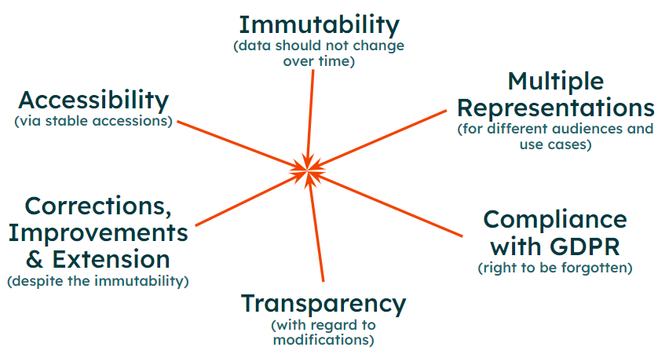

[](https://github.com/ghga-de/metldata/actions/workflows/unit_and_int_tests.yaml)
[](https://coveralls.io/github/ghga-de/metldata?branch=main)

# Metldata

metldata - A framework for handling metadata based on ETL, CQRS, and event sourcing.

## Description

<!-- Please provide a short overview of the features of this service.-->

### Scope and Features:

Metldata is a framework for handling the entire lifetime of metadata by addressing the
a complex combination of challenges that makes it suitable especially for public
archives for sensitive data:


**Figure 1| Overview of the combination of challenges during metadata handling.**

#### Immutability
It is guaranteed that data entries do not change over time making reproducibility
possible without having to rely on local snapshots.

#### Accessibility
A stable accession is assigned to each resource. Together with the immutability
property, this guarantees that you will always get the same data when querying with the
same accession.

#### Corrections, Improvements, Extensions

Even though data is stored in an immutable way, the metldata still allows for
corrections, improvements, and extensions of submitted data. This is achieved my not
just storing the current state of a submission but by persisting a version history.
Thereby, modifications are realized by issuing a new version of the submission without
affecting the content of existing versions.

#### Transparency

The version history not only resolved the conflict between immutability and the need to
evolve and adapt data, it also make the changes transparent to user relying on the data.

#### Multiple Representations

Often, the requirements regarding the structure and content of data differs depending
the use case and the audience. Metldata accounts for this by proving a configurable
workflow engine for transforming submitted metadata into multiple representation of that
data.

#### GDPR Compliance

The GDPR gives data subjects the right to issue a request to delete data. Metldata
complies with this demand. Thereby, only entire versions of a submission can be deleted.
The associated accessions stay available so that user are informed that the associated
data is not available anymore. The guarantees for immutability and stability of
accessions are not violated, however, data might become unavailable.


## Installation
We recommend using the provided Docker container.

A pre-build version is available at [docker hub](https://hub.docker.com/repository/docker/ghga/metldata):
```bash
docker pull ghga/metldata:0.2.0
```

Or you can build the container yourself from the [`./Dockerfile`](./Dockerfile):
```bash
# Execute in the repo's root dir:
docker build -t ghga/metldata:0.2.0 .
```

For production-ready deployment, we recommend using Kubernetes, however,
for simple use cases, you could execute the service using docker
on a single server:
```bash
# The entrypoint is preconfigured:
docker run -p 8080:8080 ghga/metldata:0.2.0 --help
```

If you prefer not to use containers, you may install the service from source:
```bash
# Execute in the repo's root dir:
pip install .

# To run the service:
metldata --help
```

## Configuration
### Parameters

The service requires the following configuration parameters:
- **`source_event_topic`** *(string)*: Name of the topic to which source events are published. Default: `source_events`.

- **`source_event_type`** *(string)*: Name of the event type for source events. Default: `source_event`.

- **`metadata_model_path`** *(string)*: The path to the metadata model defined in LinkML.

- **`submission_store_dir`** *(string)*: The directory where the submission JSONs will be stored.

- **`accession_store_path`** *(string)*: A file for storing the already registered accessions.

- **`prefix_mapping`** *(object)*: Specifies the ID prefix (values) per resource type (keys). Can contain additional properties.

  - **Additional Properties** *(string)*

- **`suffix_length`** *(integer)*: Length of the numeric ID suffix. Default: `8`.


### Usage:

A template YAML for configurating the service can be found at
[`./example-config.yaml`](./example-config.yaml).
Please adapt it, rename it to `.metldata.yaml`, and place it into one of the following locations:
- in the current working directory were you are execute the service (on unix: `./.metldata.yaml`)
- in your home directory (on unix: `~/.metldata.yaml`)

The config yaml will be automatically parsed by the service.

**Important: If you are using containers, the locations refer to paths within the container.**

All parameters mentioned in the [`./example-config.yaml`](./example-config.yaml)
could also be set using environment variables or file secrets.

For naming the environment variables, just prefix the parameter name with `metldata_`,
e.g. for the `host` set an environment variable named `metldata_host`
(you may use both upper or lower cases, however, it is standard to define all env
variables in upper cases).

To using file secrets please refer to the
[corresponding section](https://pydantic-docs.helpmanual.io/usage/settings/#secret-support)
of the pydantic documentation.


## Architecture and Design:
<!-- Please provide an overview of the architecture and design of the code base.
Mention anything that deviates from the standard triple hexagonal architecture and
the corresponding structure. -->

The framework uses a combination of ETL, CQRS, and event sourcing. Currently it is
designed to mostly run as a CLI application for managing metadata on the local file
system. However, later, it will be translated into a microservice based-architecture.

### One Write and Multiple Read Representations

Instead of having just a single copy of metadata in a database that
supports all CRUD actions needed by all the different user groups, we
propose to follow the CQRS pattern by having one representation that is
optimized for write operations and multiple use case-specific
representations for querying metadata. Thereby, the write-specific
representation is the source of truth and fuels all read-specific
representations through an ETL process. In the following, the
read-specific representations are also referred to as artifacts.

This setup with one write and multiple read representation has the
following advantages:

- Different subsets of the entire metadata catalog can be prepared
  with the needs and the permissions of different user audiences in
  mind.
- It allows for independent scalability of read and write operations.
- The metadata can be packaged in multiple different formats required
  and optimized for different technologies and use cases, such as
  indexed searching with ElasticSearch vs. REST or GraphQL queries
  supported by MongoDB.
- Complex write-optimized representations, which are inconvenient for
  querying such as event histories, can be used as the source of
  truth.
- Often used metadata aggregations and summary statistics can be
  precomputed.
- Read-specific representations may contain rich annotations that are
  not immediately available in the write-specific representation. For
  instance, the write-specific representation may only contain one-way
  relationships between metadata elements (e.g. a sample might define
  a `has_experiment` attribute, while an experiment defines no
  `has_sample` attribute), however, a read-specific representation may
  contain two way relationships (e.g. a sample defines a
  `has_experiment` attribute and an experiment defines a `has_sample`
  attribute).

However, there are also disadvantages that are linked to this setup that
should be considered:

- The write and read representations are only eventually consistent.
- Adds more complexity than a CRUD setup.

### Submission-centric Store as The Source of Truth

In the write-specific representation, metadata is packaged into
submissions. Each submission is fully self-contained and linking between
metadata of different submissions is not possible. A submission can have
one of the following statuses:

- pending - the construction of the submission is in progress, the
  submitter may still change its content.
- in-review - the submitter declared the submission as complete and is
  waiting for it to be reviewed, however, both the submitter and the
  reviewer can set this submission back to pending to enable further
  changes.
- canceled - the submission was canceled before its completion, its
  content was deleted.
- completed - the submission has been reviewed and approved, the
  content of the submission is frozen, and accessions are generated
  for all relevant metadata elements.
- deprecated-prepublication - the submission was deprecated and it
  cannot be published anymore, however, its content is not deleted
  from the system.
- emptied-prepublication - the submission was deprecated and its
  content was deleted from the system, however, the accessions are not
  deleted.
- published - the submission was made available to other users.
- deprecated-postpublication - the submission was deprecated and it
  should not be used anymore, however, its content stays available to
  other users.
- hidden-postpublication - the submission was deprecated and its
  content is hidden from other users but it is not deleted from the
  system, the accessions stay available, the submission can be set to
  deprecated to make its content available again.
- emptied-postpublication - the submission was deprecated and its
  content was deleted from the system, however, the accessions stay
  available.

The following status transitions are allowed:

- pending -\> in-review
- pending -\> canceled
- in-review -\> completed
- in-review -\> canceled
- in-review -\> pending
- completed -\> published
- completed -\> deprecated-prepublication
- completed -\> emptied-prepublication
- deprecated-prepublication -\> emptied-prepublication
- published -\> deprecated-postpublication
- published -\> hidden-postpublication
- published -\> emptied-postpublication
- deprecated-postpublication -\> hidden-postpublication
- deprecated-postpublication -\> emptied-postpublication
- hidden-postpublication -\> deprecated-postpublication
- hidden-postpublication -\> emptied-postpublication

A deprecated submission may or may not be succeeded by a new submission.
Thereby, the new submission may reuse (a part of) the metadata from the
deprecated submission. The reused metadata including the already
existing accessions is copied over to the new submission so that the
contents of the deprecated submission and the new submission can be
handled independently, for instance, the deprecated submission being
emptied.

### Event Sourcing to Generate Artifacts

To implement the ETL processes that generate read-specific artifacts
from the write-specific representation explained above, we propose an
event-sourcing mechanism.

The creation and each status change of a given submission (and
accommodating changes to the submission\'s content) are translated into
events. The events are cumulative and idempotent so you only have to
consume the latest event for a given submission in order to get the
latest state of that submission and a replay of the events will lead to
the same result. Thus, the event history only needs to keep the latest
event for each submission as implemented in the compacted topics offered
by Apache Kafka.

Moreover, since submissions are self-contained and do not depend on the
content of other submissions, events of different submissions can be
processed independently.

Multiple transformations (as in the ETL pattern) are applied to these
so-called source events to generate altered metadata representations
that are in turn published as events. These derived events can be again
subjected to further transformations.

Finally, the derived events are subject to load operations (as in the
ETL pattern) that aggregate the events and bring them into queryable
format (an artifact) that is accessible to users through an API.

### Metadata Modeling and Model Updates

Metadata requirements are modeled using LinkML. Thereby, the metadata
model should take the whole metadata lifecycle into account so that it
can be used to validate metadata before and after the submission as well
as for all derived artifacts.

Updates to the metadata model are classified into minor and major ones.
For minor updates, existing submissions are automatically migrated. The
submission always stores metadata together with the used metadata model.
The migration is realized through scripts that migrate metadata from an
old version to a newer version. Multiple migration scripts may be
combined to obtain a metadata representation that complies with the
newest version. The migration can be implemented as a transformation
that is applied to the source events as explained above.


## Development
For setting up the development environment, we rely on the
[devcontainer feature](https://code.visualstudio.com/docs/remote/containers) of vscode
in combination with Docker Compose.

To use it, you have to have Docker Compose as well as vscode with its "Remote - Containers"
extension (`ms-vscode-remote.remote-containers`) installed.
Then open this repository in vscode and run the command
`Remote-Containers: Reopen in Container` from the vscode "Command Palette".

This will give you a full-fledged, pre-configured development environment including:
- infrastructural dependencies of the service (databases, etc.)
- all relevant vscode extensions pre-installed
- pre-configured linting and auto-formating
- a pre-configured debugger
- automatic license-header insertion

Moreover, inside the devcontainer, a convenience commands `dev_install` is available.
It installs the service with all development dependencies, installs pre-commit.

The installation is performed automatically when you build the devcontainer. However,
if you update dependencies in the [`./setup.cfg`](./setup.cfg) or the
[`./requirements-dev.txt`](./requirements-dev.txt), please run it again.

## License
This repository is free to use and modify according to the
[Apache 2.0 License](./LICENSE).

## Readme Generation
This readme is autogenerate, please see [`readme_generation.md`](./readme_generation.md)
for details.
